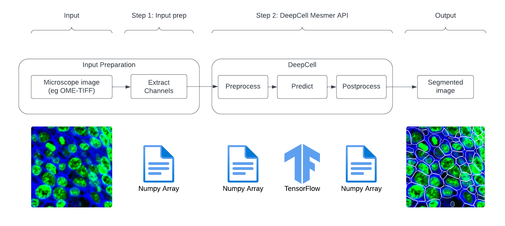

# Cloud DeepCell - Scaling Image Analysis

This working Repo contains our notes / utilities / info for our cloud [DeepCell](https://github.com/vanvalenlab/deepcell-tf) imaging project. 

Here is the high level workflow for using DeepCell:

<sub><a href="https://lucid.app/lucidchart/67c3f550-b2aa-4194-b527-56e3592829a3/edit?viewport_loc=-310%2C-595%2C3416%2C1848%2C0_0&invitationId=inv_447a9b8a-7711-43cf-a91f-e978075fc132">lucidchart source</a></sub>

Note that DeepCell itself does not process TIFF files. The TIFF channels must be extracted into Numpy arrays first.

Also note that DeepCell performs its own pre- and post-processing around the TensorFlow prediction. In particular, DeepCell divides the input into 512x512 tiles which it predicts in batches, then reconstructs the overall image.


# Running segmentation

## Configuration

You'll need a JSON file available in a cloud bucket, configuring the application environment. Create a file something like this:

```json
{
  "segment_container_image": "$REPOSITORY/benchmarking:batch",
  "quantify_container_image": "$REPOSITORY/qupath-project-initializer:latest",
  "bigquery_benchmarking_table": "$PROJECT.$DATASET.$TABLE",
  "region": "$REGION",
  "networking_interface": {
    "network": "the_network",
    "subnetwork": "the_subnetwork",
    "no_external_ip_address": true
  },
  "service_account": {
    "email": "the_service@account.com"
  }
}
```

You'll need to replace the variables with your environment.

- You can use the public Docker Hub containers, or copy them to your own artifact repository. 
- For the benchmarking, you need to create a dataset & table in a GCP project; or you can omit it or set it to blank to skip collecting benchmarks. The table must be created with the schema specified in [this file](benchmarking/bigquery_benchmarking_schema.json).
- Lastly, specify the GCP region where compute resources will be provisioned. This is not the same as storage buckets, but consider making it the same for efficiency & egress cost reduction.
- The `networking_interface` and `service_account` sections are optional if you want to use default settings.

For example, using the Docker Hub containers & skipping benchmarking & default networking + service account:

```json
{
  "segment_container_image": "dchaley/deepcell-imaging:batch",
  "quantify_container_image": "dchaley/qupath-project-initializer:latest",
  "region": "us-central1"
}
```

Upload this file somewhere to GCP storage. We put ours in the root of our working bucket. You'll pass this GS URI as a parameter to the scripts.

## Run segmentation & measurement

To run DeepCell on input images then compute QuPath measurements, use the helper `scripts/segment-and-measure.py`. There are two ways to run this script: (1) running on a QuPath workspace, and (2) running on explicit paths.

1. QuPath workspace: 

   1. Many QuPath projects are organized something like this:

      ```
      📁 Dataset
      ↳ 📁 OMETIFF
        ↳ 🖼️ SomeTissueSample.ome.tiff
        ↳ 🖼️ AnotherTissueSample.ome.tiff
      ↳ 📁 NPZ_INTERMEDIATE
        ↳ 🔢 SomeTissueSample.npz
        ↳ 🔢 AnotherTissueSample.npz
      ↳ 📁 SEGMASK
        ↳ 🔢 SomeTissueSample_WholeCellMask.tiff
        ↳ 🔢 SomeTissueSample_NucleusMask.tiff
        ↳ 🔢 AnotherTissueSample_WholeCellMask.tiff
        ↳ 🔢 AnotherTissueSample_NucleusMask.tiff
      ↳ 📁 REPORTS
        ↳ 📄 SomeTissueSample_QUANT.tsv
        ↳ 📄 AnotherTissueSample_QUANT.tsv
      ↳ 📁 PROJ
        ↳ 📁 data
          ↳ ...
        ↳ 📄 project.qpproj
      ```

      To generate segmentation masks & quantification reports, run the following command:

      ```shell
      scripts/segment-and-measure.py
        --env_config_uri gs://bucket/path/to/env-config.json
        workspace gs://bucket/path/to/dataset
      ```

      This will enumerate all files in the `OMETIFF` directory that have matching files in `NPZ_INTERMEDIATE`, and run DeepCell segmentation to generate the `SEGMASK` numpy files. Then it will run QuPath measurements to generate the `REPORTS` files.

      If your folder structure is different (for example `OME-TIFF` instead of `OMETIFF`) you can use these parameters to specify the workspace subdirectories: `--images_subdir`, `--npz_subdir`, `--segmasks_subdir`, `--project_subdir`, `--reports_subdir`. Put these parameters *after* the `workspace` command.

2. Explicit paths.

   1. You can also specify all paths explicitly (the files don't have to be organized in a dataset). To do so, run this command:

      ```shell
      scripts/segment-and-measure.py
        --env_config_uri gs://bucket/path/to/env-config.json
        paths
        --images_path gs://bucket/path/to/ometiffs
        --numpy_path gs://bucket/path/to/npzs
        --segmasks_path gs://bucket/path/to/segmasks
        --project_path gs://bucket/path/to/project
        --reports_path gs://bucket/path/to/reports
      ```

In either case, when you download the QuPath project, you'll need to download the OMETIFF files as well. When you open the project it will prompt you to select the base directory containing the OMETIFFs, and from there should automatically remap the image paths.

#### Working on a subset of images

You can use the parameter `--image_filter` to only operate on a subset of the OMETIFFs. For example,

```shell
scripts/segment-and-measure.py
  --env_config_uri gs://.../config.json
  --image_filter SomeTissue
  workspace gs://path/to/workspace
```

This will operate on every file whose name begins with the string `SomeTissue`. This would match `SomeTissueSample`, `SomeTissueImage`, etc. Note that this parameter has to come before the `workspace` or `paths` parameter.

# Benchmarking

## Goal and Key Links

- **GOAL: Understand and optimize using DeepCell to perform cellular image segmentation on GCP at scale.**
  - KEY LINK #1: our [benchmarking process](benchmarking/deepcell-e2e).
  - KEY LINK #2: our support/testing [notebooks](notebooks).
  - KEY LINK #3: our [project board](https://github.com/users/dchaley/projects/1) & work areas for this project.

## Findings

GPU makes a dramatic difference in model inference time.


Memory usage increases linearly with number of pixels.


## Optimization opportunities

Here are some areas we've identified:

- Preprocessing
  - DeepCell converts everything to 64bit float. That's memory intensive. Do we actually need to?
- Prediction
  - Benchmark results (GPU, batch size, resolution)
  - Investigate [Google TensorFlow optimizations](https://cloud.google.com/vertex-ai/docs/predictions/optimized-tensorflow-runtime)
- Postprocessing
  - h_maxima: need to ship a [~15x speedup optimization](https://github.com/dchaley/deepcell-imaging/tree/main/benchmarking/h_maxima)

# Local development

## Mac OS x86_64

Nothing special. You just need Python 3.10 at the latest.

```
python3.10 -m venv venv
source venv/bin/activate
pip install -r requirements.txt
```

## Mac OS arm64

Some incantations are needed to work on Apple silicon computers. You also need Python 3.9.

DeepCell depends on `tensorflow`, not `tensorflow-macos`. Unfortunately we need `tensorflow-macos` specifically to provide TF2.8 on arm64 chips.

The solution is to install the packages one at a time so that the DeepCell failure doesn't impact the other packages.

```
python3.9 -m venv venv
source venv/bin/activate
pip install -r requirements-mac-arm64.txt
cat requirements.txt | xargs -n 1 pip install

# Let it fail to install DeepCell, then:
pip install -r requirements.txt --no-deps

# Lastly install our own library. Note --no-deps
pip install --editable . --no-deps
```

I think but am not sure that the first `--no-deps` invocation is unnecessary as pip install installs dependencies.

